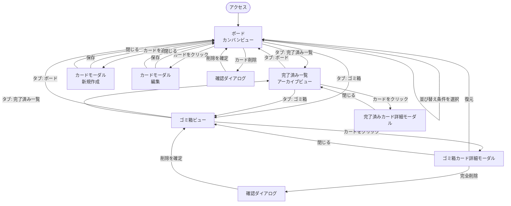
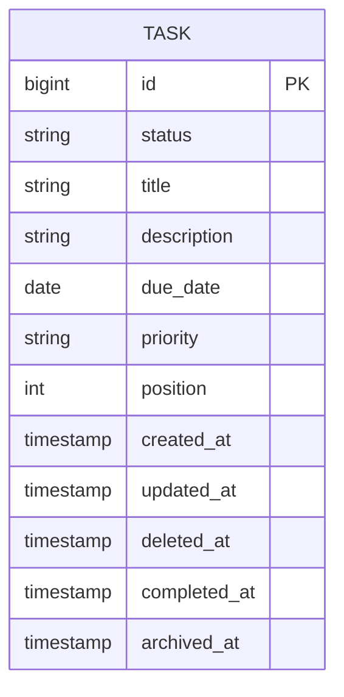

# タスク管理アプリケーション 要件定義書

## 改訂履歴

[改訂履歴はこちら](requirements-changelog.md)

---

## 目次

- [1. 概要・目的](#1-概要目的)
- [2. 想定利用者・利用シーン](#2-想定利用者利用シーン)
- [3. 機能要件](#3-機能要件)
  - [3.1 リスト（列）](#31-リスト列)
  - [3.2 カード（タスク）管理](#32-カードタスク管理)
  - [3.3 検索・表示](#33-検索表示)
- [4. 非機能要件](#4-非機能要件)
- [5. 画面一覧・画面遷移（案）](#5-画面一覧画面遷移案)
  - [5.1 画面遷移図（詳細）](#51-画面遷移図詳細)
- [6. データ項目（確定）](#6-データ項目確定)
  - [6.1 ER図（確定）](#61-er図確定)
- [7. スコープ外・将来拡張](#7-スコープ外将来拡張)
- [8. 今後の進め方（提案）](#8-今後の進め方提案)

---

## 1. 概要・目的

本アプリケーションは、Trello風のカンバン方式によるタスク管理Webアプリケーションである。
筆者が普段Notionで運用しているタスク管理ボードの構成を参考に、カード（タスク）を
「未着手／進行中／完了」の3列で直感的に管理することを目的とする。

学習課題として、個人利用のタスク管理アプリケーションとして開発する。

HTML/CSS/JSによるプロトタイプでの画面確認の結果、複数のボードを作成・切り替える構成は
個人利用の本アプリケーションには不要と判断し、**単一のカンバンビューのみを持つ構成**に
方針を変更した（詳細は5章参照）。

技術スタックはバックエンド：Java 25（LTS）/ Spring Boot 4.1.x / Gradle、フロントエンド：React（Vite + TypeScript）、データベース：PostgreSQL。詳細・選定理由は[基本設計書](basic-design.md)を参照。

## 2. 想定利用者・利用シーン

| 項目 | 内容 |
|------|------|
| 主な利用者 | 個人（自分自身のタスク管理） |
| 利用シーン | 日々のタスク・プロジェクトの進捗管理、ToDoの可視化 |

## 3. 機能要件

Trello・Notion的なカンバンツールで一般的な機能を一覧化する。
◎＝必須（MVP） ／ ○＝あると良い（後回し可） ／ △＝任意（発展課題）

### 3.1 リスト（列）

本アプリケーションはボードという概念を持たず、「未着手／進行中／完了」の3列を
固定のリストとして扱う。リストの作成・編集・削除・並び替えはスコープ外とする。

### 3.2 カード（タスク）管理

| 機能 | 優先度 | 内容 |
|------|--------|------|
| カードの作成・編集・削除 | ◎ | タイトル・説明を持つ最小単位のタスク。作成・編集は共通のモーダルUIで行う |
| カードのドラッグ&ドロップ移動 | ◎ | リスト間・リスト内での並び替え（Trelloの核となる操作） |
| 期限日の設定 | ◎ | カードに期限日を設定できる。期限切れの視覚的な強調表示は○（後回し可） |
| 優先度設定 | ◎ | 高・中・低の優先度を設定できる |
| チェックリスト（サブタスク） | △ | カード内に小タスクのリストを持たせる |
| コメント機能 | △ | カードに対するメンバー間のやり取り（個人利用のため優先度は低い） |
| 添付ファイル | △ | 画像やファイルの添付 |
| ラベル／タグ付け | △ | 色分けによるカテゴリ分類。プロトタイプ検証の結果、当面は不要と判断し対象外化 |
| カードの削除・ゴミ箱・復元 | ◎ | カード削除は論理削除としてゴミ箱に移動し、一覧から復元・完全削除できる。ゴミ箱内のカードは30日経過で自動的に完全削除される |
| 完了カードの自動アーカイブ | ◎ | `完了`列のカードは日次バッチで自動的にアーカイブへ移動し、通常のボード表示から除外される。アーカイブ済みカードは30日経過で自動的に完全削除される |

### 3.3 検索・表示

| 機能 | 優先度 | 内容 |
|------|--------|------|
| 並び替え（期限日順・優先度順） | ◎ | カード一覧を期限日または優先度で一括並び替えできる。表示切替ではなく、並び替え結果をカードの表示順として保存する（実行後は手動でドラッグ&ドロップするまでその順序を維持する）操作 |
| キーワード検索 | ○ | カードのタイトル・説明から検索 |
| フィルタ（期限） | ○ | 条件によるカードの絞り込み |

## 4. 非機能要件

| 分類 | 要件 |
|------|------|
| 対応環境 | 主要モダンブラウザ（Chrome, Edge, Safari 最新版）を想定 |
| レスポンシブ対応 | PCでの利用をメインとしつつ、タブレット幅程度までは崩れないレイアウトとする |
| データ永続化 | ページ再読み込み・再訪問後もデータが失われないこと |
| パフォーマンス | カード数百件程度までは操作にストレスがないこと |
| 保守性 | 学習課題のため、コンポーネント単位で分かりやすく分割されたコードとする |

## 5. 画面一覧・画面遷移（案）

画面遷移を伴わず、上部タブで「ボード／完了済み一覧／ゴミ箱」の3ビューを切り替える単一ページ構成とする。

| 画面名 | 概要 |
|--------|------|
| ボード（カンバンビュー） | 「未着手／進行中／完了」の固定3列でカードを表示し、ドラッグ&ドロップ・並び替えで操作するメイン画面 |
| カード詳細・追加モーダル | カードの新規作成・編集を共通のモーダルUIで行う（タイトル・説明・期限日・優先度） |
| 完了済み一覧（アーカイブビュー） | 自動アーカイブされた完了済みカードの一覧を表示する |
| 完了済みカード詳細モーダル | アーカイブ済みカードの内容を確認する |
| ゴミ箱ビュー | 論理削除されたカードの一覧を表示し、復元・完全削除を行える |
| ゴミ箱カード詳細モーダル | ゴミ箱内カードの内容確認・復元・完全削除を行う |
| 確認ダイアログ | 削除・完全削除など取り消しづらい操作の実行前に確認を求める共通ダイアログ |

### 5.1 画面遷移図（詳細）

- カード詳細・追加モーダル、各詳細モーダル、確認ダイアログはいずれも現在のビュー上に重なる形（画面遷移を伴わない）で表示する。

## 6. データ項目（確定）

Listは固定3列（未着手／進行中／完了）でありテーブル化する必要がないため、
LISTテーブルは作成せず、Taskの`status`カラムで表現する。主キーはDB側の自動採番とする。

### Task（タスク。UI上は「カード」として表示する）
| 項目 | 型（PostgreSQL） | 備考 |
|------|------|------|
| id | BIGINT（GENERATED ALWAYS AS IDENTITY） | 自動採番の主キー |
| status | VARCHAR + CHECK制約（TODO／IN_PROGRESS／DONE） | 「未着手／進行中／完了」の固定3列を表す |
| title | VARCHAR NOT NULL | タスク名 |
| description | TEXT | 詳細説明 |
| due_date | DATE | 期限日 |
| priority | VARCHAR + CHECK制約（HIGH／MEDIUM／LOW） | 優先度 |
| position | INTEGER | リスト内の表示順（手動並び替え時に使用）。`ORDER`はSQL予約語のため`position`とする |
| created_at | TIMESTAMP NOT NULL DEFAULT now() | 作成日時 |
| updated_at | TIMESTAMP NOT NULL DEFAULT now() | 更新日時 |
| deleted_at | TIMESTAMP | 論理削除日時。設定されるとゴミ箱に表示される |
| completed_at | TIMESTAMP | `完了`列に移動した日時 |
| archived_at | TIMESTAMP | 完了済み一覧（アーカイブ）へ自動移動した日時 |

### 6.1 ER図（確定）

- ボード・ユーザー・認証・ボード共有機能は本版のスコープ外（7章「スコープ外・将来拡張」参照）。
- ラベル（LABEL／TASK_LABEL）はプロトタイプ検証の結果、当面不要と判断し本版ではモデリングしない。
- チェックリスト・コメント・添付ファイル（3.2節の△項目）はMVP外のため未モデリング。実装する場合は `CHECKLIST_ITEM`（TASKに1対多）、`COMMENT`（TASKに1対多）、`ATTACHMENT`（TASKに1対多）を追加する想定。

## 7. スコープ外・将来拡張

本版では個人利用（単一ユーザー・単一カンバン）に限定する。将来的に複数ボード管理やチーム利用（複数ユーザー・共同編集）へ拡張する可能性はあるが、本要件定義書のスコープ外とする。

---

## 8. 今後の進め方（提案）

1. ~~本要件定義書の内容をレビューし、不要な機能（△・○の一部）を削る／必須化するか決定する~~ → プロトタイプ確認を踏まえ本版で反映済み
2. ~~技術スタックを決定する（基本設計書へ）~~ → 決定済み（詳細は[基本設計書](basic-design.md)参照）
3. ~~画面設計（ワイヤーフレーム）を行う~~ → HTML/CSS/JSプロトタイプで確認済み（`prototype/`配下）。データベース設計は今後実施
4. MVP（◎項目）から実装を開始する
