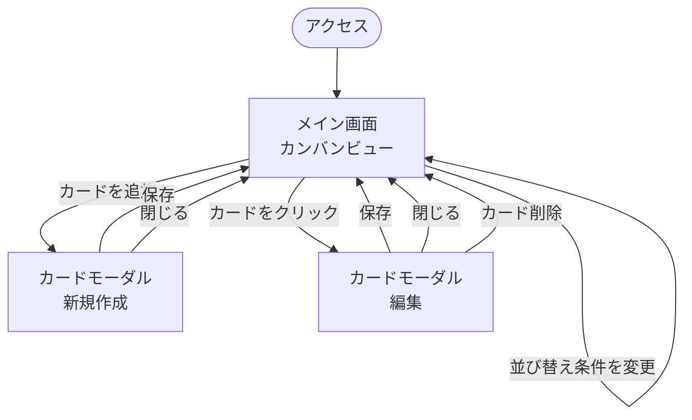
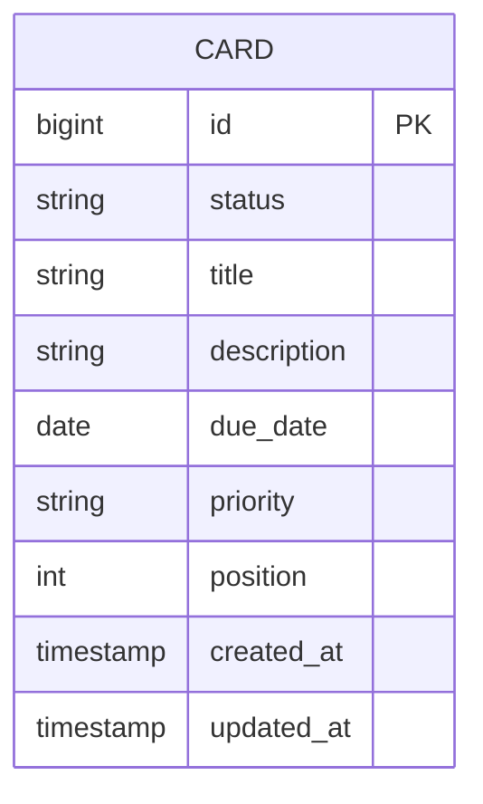

# タスク管理アプリケーション 要件定義書

## 改訂履歴

| 版数 | 日付       | 内容   | 作成者 |
|------|-----------|--------|--------|
| 0.1  | 2026-07-30 | 初版作成 | ー     |
| 0.2  | 2026-07-30 | HTML/CSS/JSプロトタイプでの画面確認を踏まえ、複数ボード管理を廃止し単一カンバン（固定3列）構成に変更。ラベル機能を対象外化、並び替え機能をMVPに格上げ | ー |
| 0.3  | 2026-07-31 | 技術スタックを選定。詳細は[基本設計書](basic-design.md)に記載 | ー |
| 0.4  | 2026-07-31 | 技術スタックのバージョン表記を最新（Java 25 LTS / Spring Boot 4.1.x）に更新 | ー |
| 0.5  | 2026-07-31 | DB実装方針を反映し、データ項目・ER図を確定（LISTテーブル廃止、主キーをDB自動採番に変更、updated_at追加） | ー |

---

## 目次

- [1. 概要・目的](#1-概要目的)
- [2. 想定利用者・利用シーン](#2-想定利用者利用シーン)
- [3. 機能要件](#3-機能要件)
  - [3.1 リスト（列）](#31-リスト列)
  - [3.2 カード（タスク）管理](#32-カードタスク管理)
  - [3.3 検索・表示](#33-検索表示)
- [4. 非機能要件](#4-非機能要件)
- [5. 画面一覧・画面遷移（案）](#5-画面一覧画面遷移案)
  - [5.1 画面遷移図（詳細）](#51-画面遷移図詳細)
- [6. データ項目（案）](#6-データ項目案)
  - [6.1 ER図（案）](#61-er図案)
- [7. 制約条件・前提](#7-制約条件前提)
- [8. 今後の進め方（提案）](#8-今後の進め方提案)

---

## 1. 概要・目的

本アプリケーションは、Trello風のカンバン方式によるタスク管理Webアプリケーションである。
筆者が普段Notionで運用しているタスク管理ボードの構成を参考に、カード（タスク）を
「未着手／進行中／完了」の3列で直感的に管理することを目的とする。

学習課題として、個人利用のタスク管理アプリケーションとして開発する。

HTML/CSS/JSによるプロトタイプでの画面確認の結果、複数のボードを作成・切り替える構成は
個人利用の本アプリケーションには不要と判断し、**単一のカンバンビューのみを持つ構成**に
方針を変更した（詳細は5章参照）。

## 2. 想定利用者・利用シーン

| 項目 | 内容 |
|------|------|
| 主な利用者 | 個人（自分自身のタスク管理） |
| 利用シーン | 日々のタスク・プロジェクトの進捗管理、ToDoの可視化 |

## 3. 機能要件

Trello・Notion的なカンバンツールで一般的な機能を一覧化する。
◎＝必須（MVP） ／ ○＝あると良い（後回し可） ／ △＝任意（発展課題）

### 3.1 リスト（列）

本アプリケーションはボードという概念を持たず、「未着手／進行中／完了」の3列を
固定のリストとして扱う。リストの作成・編集・削除・並び替えはスコープ外とする。

### 3.2 カード（タスク）管理

| 機能 | 優先度 | 内容 |
|------|--------|------|
| カードの作成・編集・削除 | ◎ | タイトル・説明を持つ最小単位のタスク。作成・編集は共通のモーダルUIで行う |
| カードのドラッグ&ドロップ移動 | ◎ | リスト間・リスト内での並び替え（Trelloの核となる操作） |
| 期限日の設定 | ◎ | カードに期限日を設定できる。期限切れの視覚的な強調表示は○（後回し可） |
| 優先度設定 | ◎ | 高・中・低の優先度を設定できる |
| チェックリスト（サブタスク） | △ | カード内に小タスクのリストを持たせる |
| コメント機能 | △ | カードに対するメンバー間のやり取り（個人利用のため優先度は低い） |
| 添付ファイル | △ | 画像やファイルの添付 |
| ラベル／タグ付け | △ | 色分けによるカテゴリ分類。プロトタイプ検証の結果、当面は不要と判断し対象外化 |

### 3.3 検索・表示

| 機能 | 優先度 | 内容 |
|------|--------|------|
| 並び替え（期限日順・優先度順） | ◎ | カード一覧を期限日または優先度でソート表示できる。ドラッグ&ドロップによる手動並び替えと切り替え可能 |
| キーワード検索 | ○ | カードのタイトル・説明から検索 |
| フィルタ（期限） | ○ | 条件によるカードの絞り込み |

## 4. 非機能要件

| 分類 | 要件 |
|------|------|
| 対応環境 | 主要モダンブラウザ（Chrome, Edge, Safari 最新版）を想定 |
| レスポンシブ対応 | PCでの利用をメインとしつつ、タブレット幅程度までは崩れないレイアウトとする |
| データ永続化 | ページ再読み込み・再訪問後もデータが失われないこと |
| パフォーマンス | カード数百件程度までは操作にストレスがないこと |
| 保守性 | 学習課題のため、コンポーネント単位で分かりやすく分割されたコードとする |

## 5. 画面一覧・画面遷移（案）

```
[メイン画面（カンバンビュー）] ──カードクリック／カード追加──▶ [カード詳細・追加モーダル]
```

| 画面名 | 概要 |
|--------|------|
| メイン画面（カンバンビュー） | 「未着手／進行中／完了」の固定3列でカードを表示し、ドラッグ&ドロップ・並び替えで操作する唯一の画面 |
| カード詳細・追加モーダル | カードの新規作成・編集を共通のモーダルUIで行う（タイトル・説明・期限日・優先度） |

### 5.1 画面遷移図（詳細）



- カード詳細・追加モーダルは、メイン画面上に重なる形（画面遷移を伴わない）を想定。

## 6. データ項目（確定）

Listは固定3列（未着手／進行中／完了）でありテーブル化する必要がないため、
LISTテーブルは作成せず、Cardの`status`カラムで表現する。主キーはDB側の自動採番とする。

### Card（カード＝タスク）
| 項目 | 型（PostgreSQL） | 備考 |
|------|------|------|
| id | BIGINT（GENERATED ALWAYS AS IDENTITY） | 自動採番の主キー |
| status | VARCHAR + CHECK制約（TODO／IN_PROGRESS／DONE） | 「未着手／進行中／完了」の固定3列を表す |
| title | VARCHAR NOT NULL | タスク名 |
| description | TEXT | 詳細説明 |
| due_date | DATE | 期限日 |
| priority | VARCHAR + CHECK制約（HIGH／MEDIUM／LOW） | 優先度 |
| position | INTEGER | リスト内の表示順（手動並び替え時に使用）。`ORDER`はSQL予約語のため`position`とする |
| created_at | TIMESTAMP NOT NULL DEFAULT now() | 作成日時 |
| updated_at | TIMESTAMP NOT NULL DEFAULT now() | 更新日時 |

### 6.1 ER図（確定）



- ボード・ユーザー・認証・ボード共有機能は本版のスコープ外（7章「拡張予定」参照）。
- ラベル（LABEL／CARD_LABEL）はプロトタイプ検証の結果、当面不要と判断し本版ではモデリングしない。
- チェックリスト・コメント・添付ファイル（3.2節の△項目）はMVP外のため未モデリング。実装する場合は `CHECKLIST_ITEM`（CARDに1対多）、`COMMENT`（CARDに1対多）、`ATTACHMENT`（CARDに1対多）を追加する想定。

## 7. 制約条件・前提

| 項目 | 内容 |
|------|------|
| 開発体制 | 個人（学習課題としての開発） |
| 技術スタック | バックエンド：Java 25（LTS） / Spring Boot 4.1.x / Gradle、フロントエンド：React（Vite + TypeScript）、データベース：PostgreSQL。詳細・選定理由は[基本設計書](basic-design.md)を参照 |
| スケジュール | 学校課題の提出期限に準拠（要確認） |
| 評価観点 | 学校側の評価基準に準拠（要確認） |
| 開発規模 | MVP（◎項目）をまず実装し、余力に応じて○・△項目を追加する段階的開発とする |
| 拡張予定 | 本版では個人利用（単一ユーザー・単一カンバン）に限定する。将来的に複数ボード管理やチーム利用（複数ユーザー・共同編集）へ拡張する可能性はあるが、本要件定義書のスコープ外とする |

---

## 8. 今後の進め方（提案）

1. ~~本要件定義書の内容をレビューし、不要な機能（△・○の一部）を削る／必須化するか決定する~~ → プロトタイプ確認を踏まえ本版で反映済み
2. ~~技術スタックを決定する（基本設計書へ）~~ → 決定済み（詳細は[基本設計書](basic-design.md)参照）
3. ~~画面設計（ワイヤーフレーム）を行う~~ → HTML/CSS/JSプロトタイプで確認済み（`prototype/`配下）。データベース設計は今後実施
4. MVP（◎項目）から実装を開始する
