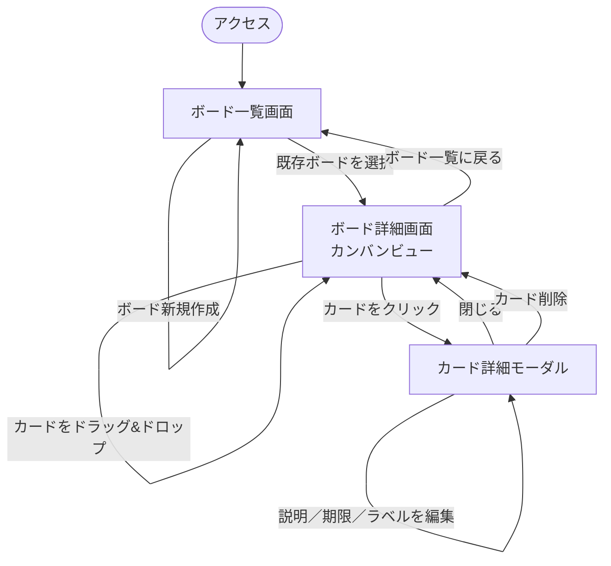
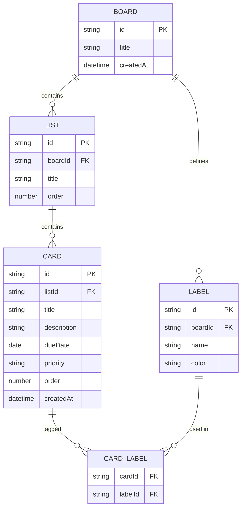

# タスク管理アプリケーション 要件定義書

## 改訂履歴

| 版数 | 日付       | 内容   | 作成者 |
|------|-----------|--------|--------|
| 0.1  | 2026-07-30 | 初版作成 | ー     |

---

## 1. 概要・目的

本アプリケーションは、Trello風のカンバン方式によるタスク管理Webアプリケーションである。
筆者が普段Notionで運用しているタスク管理ボードの構成を参考に、ボード・リスト・カードによる
直感的なタスク管理を実現することを目的とする。

学習課題として、個人利用のタスク管理アプリケーションとして開発する。

## 2. 想定利用者・利用シーン

| 項目 | 内容 |
|------|------|
| 主な利用者 | 個人（自分自身のタスク管理） |
| 利用シーン | 日々のタスク・プロジェクトの進捗管理、ToDoの可視化 |

## 3. 機能要件

Trello・Notion的なカンバンツールで一般的な機能を一覧化する。
◎＝必須（MVP） ／ ○＝あると良い（後回し可） ／ △＝任意（発展課題）

### 3.1 ボード管理

| 機能 | 優先度 | 内容 |
|------|--------|------|
| ボードの作成・編集・削除 | ◎ | プロジェクト単位でボードを分けられる |
| ボード一覧表示 | ◎ | 自分が所属するボードを一覧表示 |

### 3.2 リスト（列）管理

| 機能 | 優先度 | 内容 |
|------|--------|------|
| リストの作成・編集・削除 | ◎ | 例：「未着手／進行中／完了」など自由に定義 |
| リストの並び替え | ○ | ドラッグ&ドロップで列の順序を変更 |

### 3.3 カード（タスク）管理

| 機能 | 優先度 | 内容 |
|------|--------|------|
| カードの作成・編集・削除 | ◎ | タイトル・説明を持つ最小単位のタスク |
| カードのドラッグ&ドロップ移動 | ◎ | リスト間・リスト内での並び替え（Trelloの核となる操作） |
| 期限日の設定 | ○ | 期限切れの視覚的な強調表示 |
| ラベル／タグ付け | ○ | 色分けによるカテゴリ分類 |
| 優先度設定 | ○ | 高・中・低などの優先度 |
| チェックリスト（サブタスク） | △ | カード内に小タスクのリストを持たせる |
| コメント機能 | △ | カードに対するメンバー間のやり取り |
| 添付ファイル | △ | 画像やファイルの添付 |

### 3.4 検索・表示

| 機能 | 優先度 | 内容 |
|------|--------|------|
| キーワード検索 | ○ | カードのタイトル・説明から検索 |
| フィルタ（ラベル・期限） | ○ | 条件によるカードの絞り込み |
| 並び替え（作成日・期限・優先度） | △ | 表示順のカスタマイズ |

## 4. 非機能要件

| 分類 | 要件 |
|------|------|
| 対応環境 | 主要モダンブラウザ（Chrome, Edge, Safari 最新版）を想定 |
| レスポンシブ対応 | PCでの利用をメインとしつつ、タブレット幅程度までは崩れないレイアウトとする |
| データ永続化 | ページ再読み込み・再訪問後もデータが失われないこと |
| パフォーマンス | カード数百件程度までは操作にストレスがないこと |
| 保守性 | 学習課題のため、コンポーネント単位で分かりやすく分割されたコードとする |

## 5. 画面一覧・画面遷移（案）

```
[ボード一覧画面] ──選択──▶ [ボード詳細画面（カンバンビュー）]
                                  │
                                  ├─ カードクリック ▶ [カード詳細モーダル]
                                  ├─ リスト追加
                                  └─ カード追加
```

| 画面名 | 概要 |
|--------|------|
| ボード一覧画面 | 所属ボードの一覧・新規作成 |
| ボード詳細画面（カンバンビュー） | リスト・カードを表示し、ドラッグ&ドロップで操作する中心画面 |
| カード詳細モーダル | カードの詳細情報（説明・期限・ラベル等）を編集 |

### 5.1 画面遷移図（詳細）



- カード詳細モーダルは、ボード詳細画面上に重なる形（画面遷移を伴わない）を想定。

## 6. データ項目（案）

### Board（ボード）
| 項目 | 型 | 備考 |
|------|----|------|
| id | string | 一意識別子 |
| title | string | ボード名 |
| createdAt | datetime | 作成日時 |

### List（リスト）
| 項目 | 型 | 備考 |
|------|----|------|
| id | string | 一意識別子 |
| boardId | string | 所属ボード |
| title | string | 例：未着手／進行中／完了 |
| order | number | 表示順 |

### Card（カード＝タスク）
| 項目 | 型 | 備考 |
|------|----|------|
| id | string | 一意識別子 |
| listId | string | 所属リスト |
| title | string | タスク名 |
| description | string | 詳細説明 |
| dueDate | date | 期限日 |
| priority | enum | 高／中／低 |
| labels | string[] | タグ・ラベル |
| order | number | リスト内の表示順 |
| createdAt | datetime | 作成日時 |

### 6.1 ER図（案）

上記のデータ項目では `labels` を配列として表現しているが、
RDB設計を見据えて中間テーブル（CardLabel）に正規化した形で示す。



- `LABEL` はボード単位で定義する想定（Trelloのラベルに準拠）。`CARD_LABEL` で多対多を表現する。
- チェックリスト・コメント・添付ファイル（3.3節の△項目）はMVP外のため未モデリング。実装する場合は `CHECKLIST_ITEM`（CARDに1対多）、`COMMENT`（CARDに1対多）、`ATTACHMENT`（CARDに1対多）を追加する想定。
- ユーザー・認証・ボード共有機能は本版のスコープ外（7章「拡張予定」参照）。

## 7. 制約条件・前提

| 項目 | 内容 |
|------|------|
| 開発体制 | 個人（学習課題としての開発） |
| 技術スタック | 未確定。本要件定義書では技術非依存とし、基本設計フェーズで選定する |
| スケジュール | 学校課題の提出期限に準拠（要確認） |
| 評価観点 | 学校側の評価基準に準拠（要確認） |
| 開発規模 | MVP（◎項目）をまず実装し、余力に応じて○・△項目を追加する段階的開発とする |
| 拡張予定 | 本版では個人利用（単一ユーザー）に限定する。将来的にチーム利用（複数ユーザー・共同編集）へ拡張する可能性はあるが、本要件定義書のスコープ外とする |

---

## 8. 今後の進め方（提案）

1. 本要件定義書の内容をレビューし、不要な機能（△・○の一部）を削る／必須化するか決定する
2. 技術スタックを決定する（基本設計書へ）
3. 画面設計（ワイヤーフレーム）・データベース設計を行う
4. MVP（◎項目）から実装を開始する
